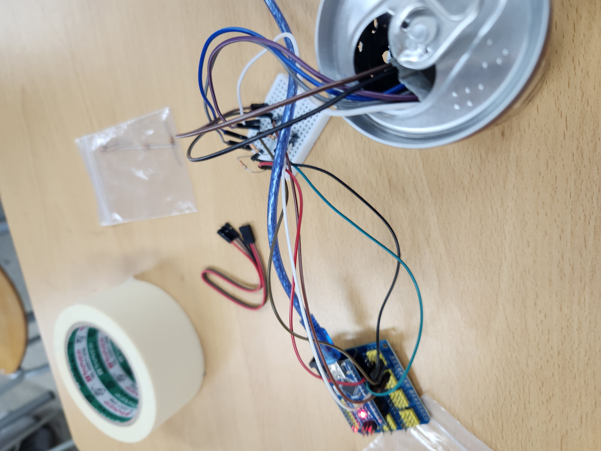

# eco-art-project
# 🌱 에코아트 프로젝트: [작품명]

## 📖 프로젝트 개요
- **제작자**: 김성빈
- **제작일**: 2025.07.16
- **소개**
  버려지는 쓰레기들을 가지고 재활용해서 일상생활에 활용 가능한 물거능로 만들었고 길거리에 버리는 쓰레기들도 물건이 될수 있다는 것을 보여주고 싶었다.

## 📦 사용 재료
- 아두이노, LED, 브레드보드
- 캔

## 🔧 제작 과정

### 1단계: 아이디어 스케치

- 아이디어 설명
LED와 캔을 이용하여 무드등을 만들었다
- 예상 완성도
- 이상할거 같다

### 2단계: 완성품

## 💭 제작 후기
### 잘된 점
- LED가 번갈아 잘 켜진다

### 아쉬운 점
- 빛 세기가 약하다

### 개선할 점
- 완성이 잘 되지 않았다.

### 내가 이미 알고 있었던 rjt
 코딩

### 새롭게 배운게 된 것
- LED의 빛 세기가 다 다른걸 알게 되었고 아두이노에 대해서도 알게 되었다.

### 더 알고 싶은 것
- 아두이노에 대해서 더 알고 싶다.

## 🌍 환경적 의미
- 이 작품이 환경에 미치는 긍정적 영향
- 사용한 재활용 재료가 환경에 미치는 의미
- 앞으로의 환경 보호 다짐 등

## 📚 참고 자료
- [환경 관련 웹사이트](링크)
- [참고한 에코아트 작품](링크)

## 🏷️ 태그
#에코아트 #재활용 #환경보호 #DIY #창의활동

---

> 이 프로젝트는 환경 보호와 창의적 사고를 위한 교육 목적으로 제작되었습니다.
